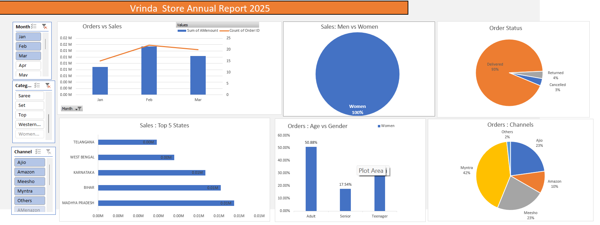

# Vrinda Store Annual Report 2025 📊

## 📌 Project Overview
This project is an interactive Excel dashboard analyzing the annual sales performance of Vrinda Store for the year 2025.

The dashboard provides insights into sales trends, customer demographics, order status, and state-wise performance.

---

## 🎯 Project Objective
- Analyze total sales and total orders
- Compare sales between Men and Women
- Track monthly sales trends
- Identify top-performing states
- Understand order status distribution

---

## 📂 Files Included
- Book1.xlsx → Main Excel Dashboard File
- dashboard.png → Dashboard Preview Image

---

## 🛠 Tools Used
- Microsoft Excel
- Pivot Tables
- Charts
- Slicers
- Data Cleaning Techniques

---

## 📸 Dashboard Preview

---

## 📊 Key Insights
- Women customers contribute a major portion of sales.
- February shows higher sales compared to January and March.
- Most orders are successfully delivered.
- A few states contribute significantly to total revenue.

---

👨‍💻 Created by Deepak Singh  
🚀 Aspiring Data Analyst
